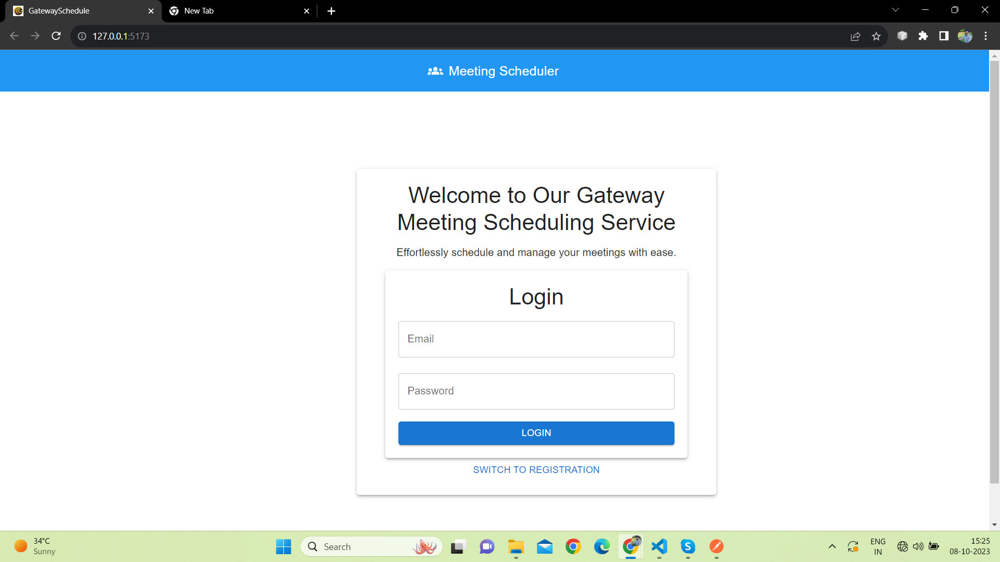
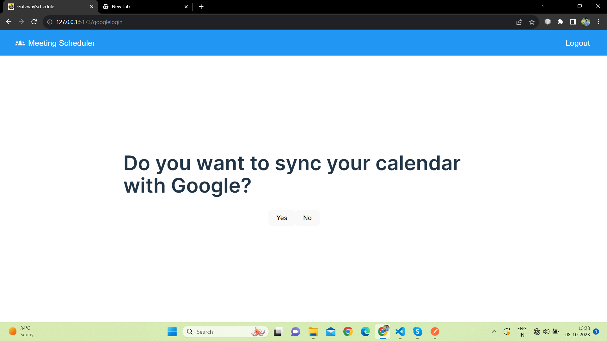

# Personal-Meeting-Scheduling-Platform (Frontend)

## Description

Personal Meeting Scheduling Platform allows users to register and connect their Google calendar. The platform offers a unified view of the Google calendar in a custom week view calendar and allow users to define their availability for the next three months.
 -- Users can book time slots on another user's calendar based on their availability, specifying the duration of the meeting.
 -- User registration also include email validation using OTP for validating the account.






## Table of Contents

- [Personal-Meeting-Scheduling-Platform (Frontend)](#personal-meeting-scheduling-platform-frontend)
  - [Description](#description)
  - [Table of Contents](#table-of-contents)
  - [Installation](#installation)
  - [Usage](#usage)
  - [License](#license)

## Installation

Follow these steps to set up and run the project on your local machine:

1. **Clone the Repository:**

   ```bash
   git clone https://github.com/your-username/reactscheduling.git

Replace your-username with your GitHub username or provide the correct repository URL.

2. **Navigate to the Project Directory:**

cd reactscheduling

3. **Install Dependencies:**

npm install

4. **Start the Development Server:**

npm run dev

This command will start the development server using Vite, which is the build tool specified in your scripts section. By default, the application should be accessible at <http://localhost:3000>.

## Usage

To use this application, follow these steps:

1. **Registration and Email Verification:**
   - Users must register themselves by providing their basic details.
   - After registration, users have to verify their email address through an OTP (One-Time Password) sent to their registered email.

2. **Logging In:**
   - Once registered and verified, users can log in to the application using their credentials.

3. **Syncing Google Calendar:**
   - After logging in, users have the option to sync their Google Calendar with the application.
   - This feature allows users to view their Google Calendar events in a custom week calendar within the app.

## License

This project is licensed under the [MIT License](LICENSE).
